## Wildberries, Ozon и Google sheets в DataLens

Мой первый коммерческий проект: перевод системы анализа и учета продаж через Wildberries, Ozon, а также в розницу и оптом из таблиц Google sheets на аналитические дашборды в DataLens. У заказчика была реализована выгрузка по API из Wildberries и Ozon в Google sheets с дальнейшей обработкой и агрегацией этих и своих данных по рознице и опту в эксельках.

К сожалению, никакой документации у заказчика не было. Необходимо было разбираться с двумя десятками файлов Google sheets, в каждом из которых от 20 до 30 листов — где-то листы были давно заброшены, где-то были промежуточные вычисления, где-то агрегация проходила через Apps Script, где формулами, где-то просто были напечатаны вручную.

После пары недель изучения массива данных решил делать полностью новую систему, ориентируясь на то, что есть у заказчика, только для сравнения результирующих показателей. Систему реализовал на базе Яндекс.Облака, в котором развернул PostgreSQL-сервер, ETL-скрипты на Python запускаются по таймеру в Cloud Functions, а дашборды строятся в Datalens.

Архитектура системы проучилась следующей: 

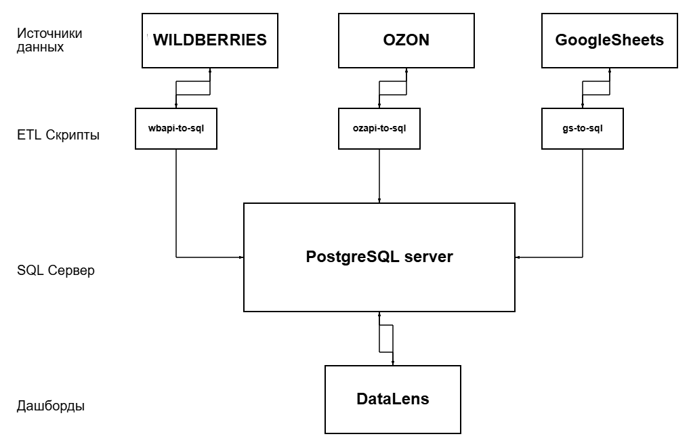 

Данные по API через ETL-скрипты, которые запускаются по таймеру в ночное время, экспортируются из Wildberries, Ozon и Google sheets в БД PostgreSQL. Из Datalens в основном через SQL-запросы берутся нужные данные для построения дашбордов.

Коды ETL-скриптов приложены в этой папке.

**Скриншоты дашбордов DataLens**

|  |  |  |
| -- | --- | --- |
|  |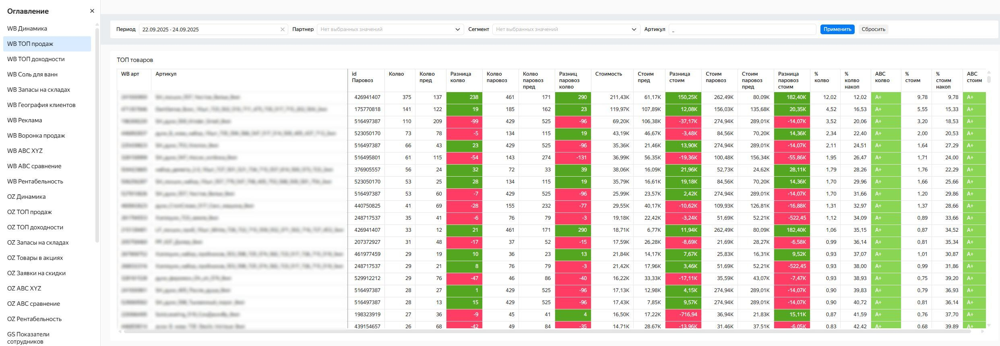 |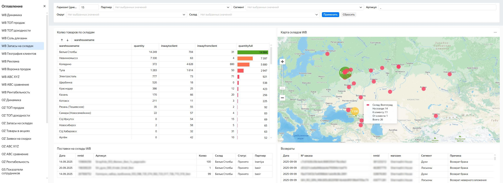 | 
| Динамика продаж  | ТОП продаж   | Запасы на складах |
| 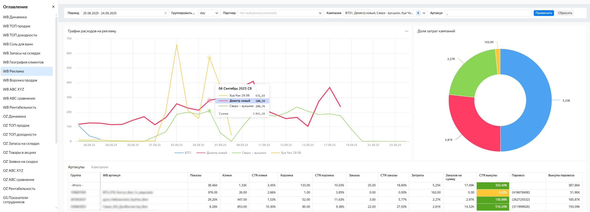 |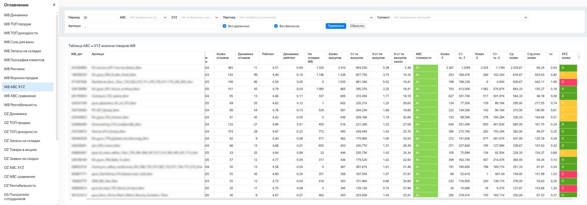 |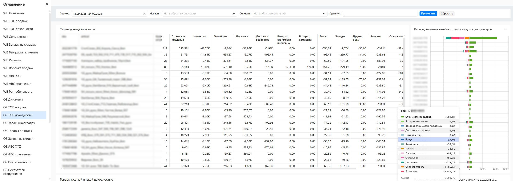 | 
| Рекламные кампании  | ABC / XYZ анализ | ТОП доходности |
| 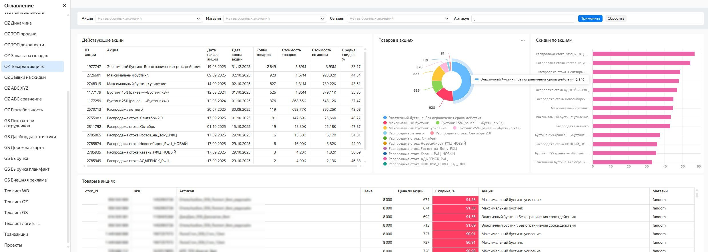 |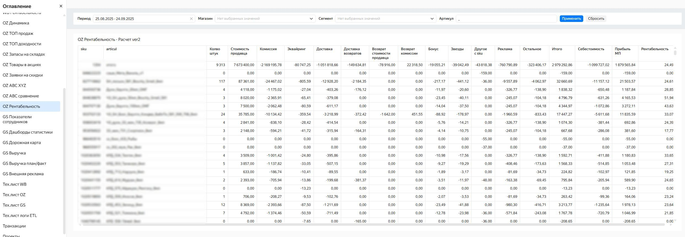 |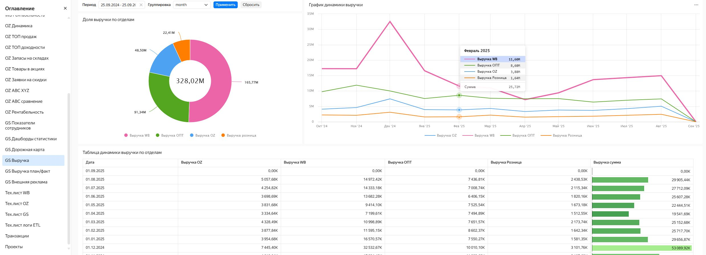 | 
| Товары в акциях  | Рентабельность | Выручка по отделам |
| 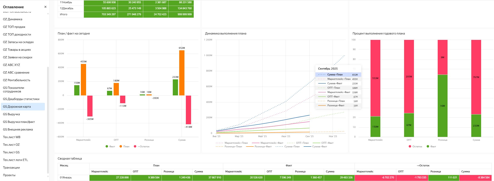 |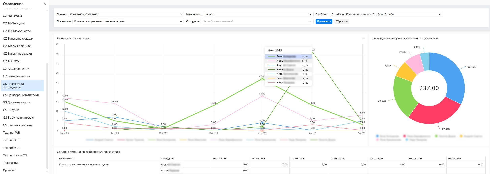 |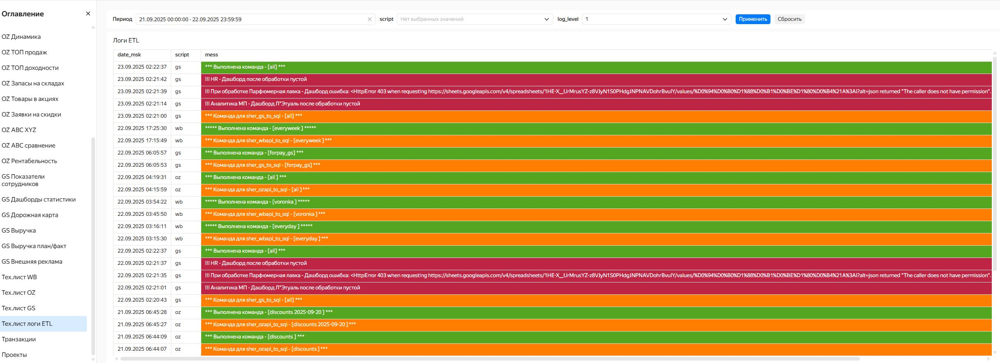 | 
| План/факт  | Показатели сотрудников | Логгирование ETL-скриптов |
