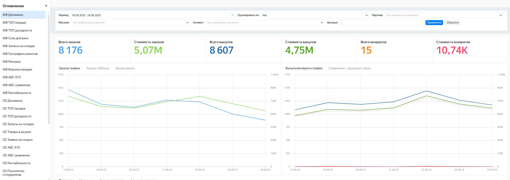
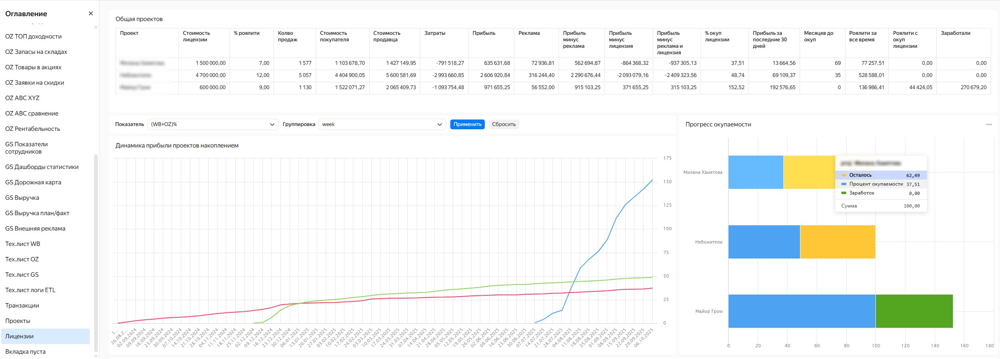

## Дашборды аналитики данных из API Wildberries, Ozon и Google sheets в DataLens

Мой первый коммерческий проект: перевод системы анализа и учета продаж через Wildberries, Ozon, а также в розницу и оптом из таблиц Google sheets на аналитические дашборды в DataLens. У заказчика была реализована выгрузка по API из Wildberries и Ozon в Google sheets с дальнейшей обработкой и агрегацией этих и своих данных по рознице и опту в эксельках.

К сожалению, никакой документации у заказчика не было. Необходимо было разбираться с двумя десятками файлов Google sheets, в каждом из которых от 20 до 30 листов — где-то листы были давно заброшены, где-то были промежуточные вычисления, где-то агрегация проходила через Apps Script, где формулами, где-то просто были напечатаны вручную.

После пары недель изучения массива данных решил делать полностью новую систему, ориентируясь на то, что есть у заказчика, только для сравнения результирующих показателей. Систему реализовал на базе Яндекс.Облака, в котором развернул PostgreSQL-сервер, ETL-скрипты на Python запускаются по таймеру в Cloud Functions, а дашборды строятся в Datalens.

## Архитектура системы

Данные по API через ETL-скрипты, которые запускаются по таймеру в ночное время, экспортируются из Wildberries, Ozon и Google Sheets в БД PostgreSQL. Для построения дашбордов в DataLens нужные данные берутся из БД в основном через SQL-запросы.

## ETL-скрипты

ETL-скрипт представляет из себя набор процедур — основных и вспомогательных — которые запускаются по таймеру через параметры командной строки. К вспомогательным относятся процедуры начальной инициализации, работы с SQL (через psycopg2), типового запроса к API, обработки данных, логирования. На запрос к каждой отдельной функции API есть своя процедура. Также предусмотрены процедуры, которые последовательно запускают нужные процедуры, чтобы провести опрос необходимых API по "одной кнопке".

Основные этапы работы ETL-скриптов:

- инициализация
- запрос по http определенной функции API с нужным набором входных параметров
- получение ответа в json-формате
- декодирование ответа из API в pandas
- предобработка данных
- импорт в SQL

Некоторые запросы выполняются в 2-3 шага - это случаи, когда надо сделать к API предварительный запрос, а для основного запроса использовать данные из первого ответа.

**Код ETL-скриптов**: [googlesheets-to-sql](/sher-googlesheets-to-sql.py), [oz-to-sql](/sher-ozapi-to-sql.py), [wb-to-sql](/sher-wbapi-to-sql.py)

## База данных

База данных работает на сервере PostgreSQL в Яндекс.Облаке. В базе данных более 40 таблиц, общим объемом данных за 8 месяцев около 3 ГБ. Это таблицы, которые содержат как данные из API, так и вспомогательные / справочные таблицы (курсы валют, координаты складов).

Условно таблицы можно разделить на три категории по методу обновления:

- таблицы, данные в строках которых не меняются, только прибавляются новые строки. В этом случае при импорте данных добавляются только новые строки (ключевые поля / комбинации уникальных столбцов), а дубликаты с уже существующими в таблице данными игнорируются (ON CONFLICT DO NOTHING)

- таблицы, данные в которых могут как меняться в отдельных ячейках, а также добавляются новые строки. Здесь сначала определяется, какие записи уже есть в таблице, а каких нет (средствами pandas, то есть вместе с API запрашиваются и данные из SQL). Новые записи просто добавляются в таблицу. Среди записей, которые уже есть в таблице, определяются те, в которых произошли изменения в отдельных ячейках, и такие записи в SQL обновлются новыми значениями.

- таблицы, которые представляют собой «снимок текущего состояния», такие таблицы полностью обновляются. То есть удаляются все существующие записи и уже в пустую таблицу импортируются свежие данные.

Хранимые процедуры и представления - не используются.

## Дашборды DataLens
 
Для построения дашбордов, в основном, используются SQL-запросы, так как требуемые метрики подразумевают построение нескольких промежуточных таблиц, а вычисляемые поля DataLens не позволяют сделать такие многоэтапные агрегации. В DataLens чаще всего используется чарт «Таблица», также используются «Графики», «Столбчатые», «Линейные» и «Круговые» диаграммы, а также «Карты».

[Примеры SQL запросов](/sher-sql.txt)

**Скриншоты дашбордов DataLens**

|  |  |  |
| -- | --- | --- |
|  |  | |
| Главная панель | Динамика продаж  | ТОП продаж  |
|  | | | 
| Рекламные кампании  | ABC / XYZ анализ | ТОП доходности |
| |  |  
| Запасы на складах | Товары в акциях  | Рентабельность | 
|  | | | 
| План/факт  | Показатели сотрудников | Выручка по отделам |
| | | | 
| Окупаемость лицензий | План/факт по отделам | Логгирование ETL-скриптов |
